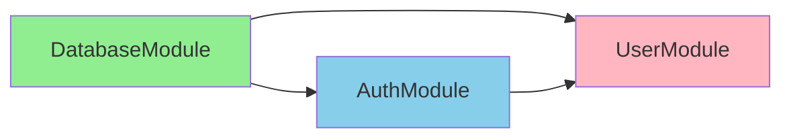
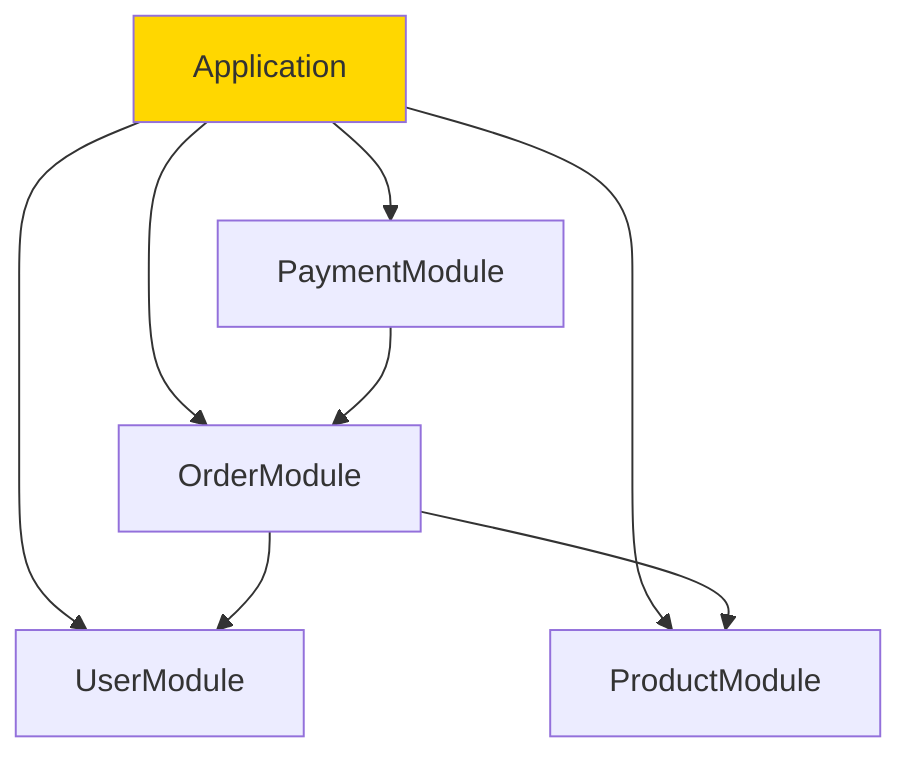
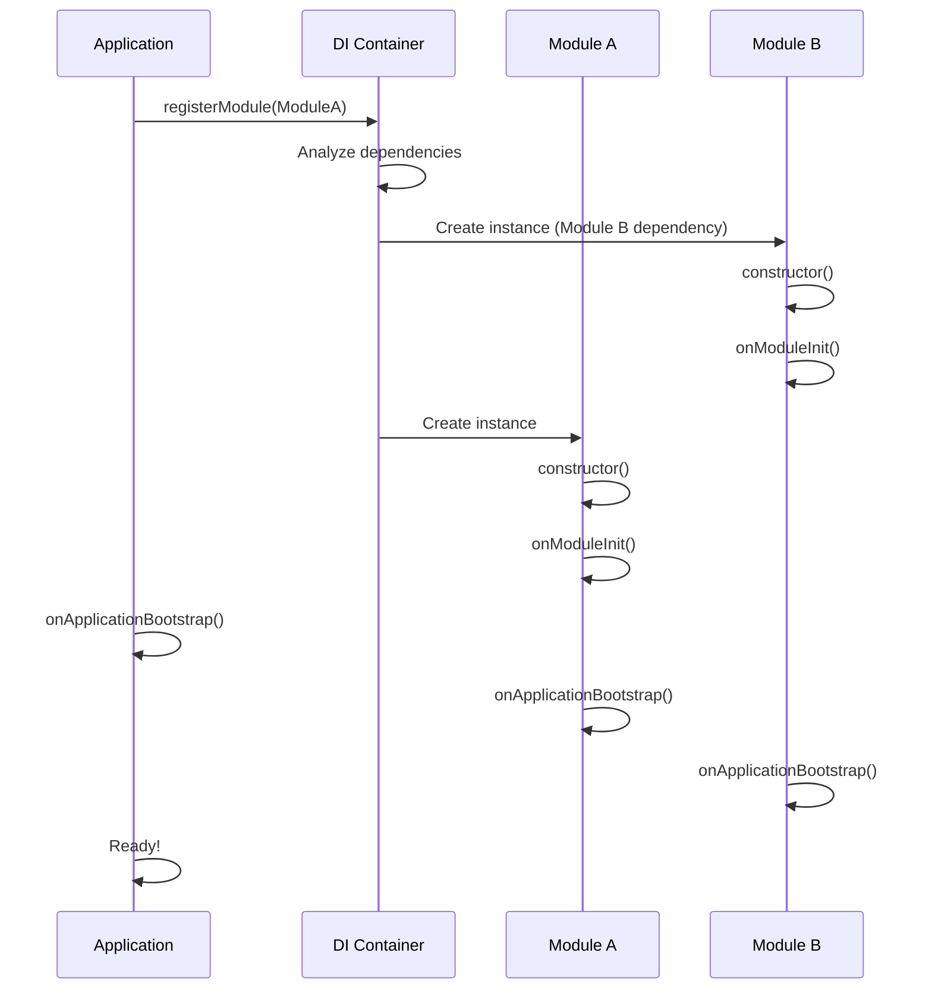

# Module Loading: Initialization and Dependency Resolution

Module loading is the process of initializing modules, resolving their dependencies, and setting up the application. Understanding this lifecycle is crucial for building robust applications that handle complex dependency graphs and can scale from monoliths to microservices.

## Module Initialization Lifecycle

Every module goes through a predictable initialization lifecycle:

```
Constructor → onModuleInit() → onApplicationBootstrap() → Ready
```

### 1. Constructor Phase

The module class is instantiated, and dependency injection provides all required dependencies:

```typescript
@Injectable()
export class DatabaseService {
  constructor(
    private readonly configService: ConfigService,
    private readonly loggerService: LoggerService,
  ) {
    // Constructor runs first
    // Dependencies are resolved and injected
    console.log('DatabaseService instantiated');
  }
}
```

### 2. onModuleInit Phase

Implement the `OnModuleInit` interface to run initialization logic after dependencies are ready:

```typescript
import { OnModuleInit } from '@framework/core';

@Injectable()
export class DatabaseService implements OnModuleInit {
  private connection: any;

  constructor(
    private readonly configService: ConfigService,
  ) {}

  async onModuleInit(): Promise<void> {
    // Called after constructor and all dependencies are available
    // Use for async initialization like connecting to databases
    const config = this.configService.getDatabaseConfig();
    this.connection = await createDatabaseConnection(config);
    console.log('Database connection established');
  }

  getConnection() {
    return this.connection;
  }
}
```

### 3. onApplicationBootstrap Phase

Implement the `OnApplicationBootstrap` interface to run code after the entire application is ready:

```typescript
import { OnApplicationBootstrap } from '@framework/core';

@Injectable()
export class CacheService implements OnApplicationBootstrap {
  constructor(
    private readonly dataService: DataService,
    private readonly loggerService: LoggerService,
  ) {}

  async onApplicationBootstrap(): Promise<void> {
    // Called after all modules are initialized
    // Use for setup that depends on the entire application
    const data = await this.dataService.fetchCriticalData();
    this.preloadCache(data);
    this.loggerService.log('Cache preloaded');
  }

  private preloadCache(data: any[]) {
    // Pre-populate cache with data
  }
}
```

### Complete Lifecycle Example

```typescript
@Injectable()
export class ApiClientService implements OnModuleInit, OnApplicationBootstrap {
  private client: any;

  constructor(
    private readonly configService: ConfigService,
    private readonly retryService: RetryService,
  ) {
    console.log('1. Constructor: ApiClientService created');
  }

  async onModuleInit(): Promise<void> {
    console.log('2. onModuleInit: Initializing client');
    const baseUrl = this.configService.getApiBaseUrl();
    this.client = createHttpClient(baseUrl);
  }

  async onApplicationBootstrap(): Promise<void> {
    console.log('3. onApplicationBootstrap: Verifying API health');
    const isHealthy = await this.client.checkHealth();
    if (!isHealthy) {
      this.retryService.scheduleRetry();
    }
  }

  async request(endpoint: string, options?: any) {
    return this.client.request(endpoint, options);
  }
}
```

## Module Loading Order

The framework uses a **topological sort** algorithm to determine the order in which modules are loaded. Dependencies are loaded before the modules that require them:

```typescript
// user.module.ts
@Module({
  imports: [DatabaseModule, AuthModule],
  controllers: [UserController],
  providers: [UserService],
})
export class UserModule {}

// database.module.ts
@Module({
  providers: [DatabaseService],
  exports: [DatabaseService],
})
export class DatabaseModule {}

// auth.module.ts
@Module({
  imports: [DatabaseModule],
  providers: [AuthService],
  exports: [AuthService],
})
export class AuthModule {}
```

Loading order:
1. **DatabaseModule** - No dependencies, loads first
2. **AuthModule** - Depends on DatabaseModule, loads second
3. **UserModule** - Depends on both, loads last

```
DatabaseModule → AuthModule → UserModule
```

### Visualizing the Dependency Graph



## Circular Dependencies

Circular dependencies occur when modules depend on each other, directly or indirectly:

```typescript
// ❌ Direct circular dependency
@Module({
  imports: [ServiceB], // ServiceB imports ServiceA
  providers: [ServiceA],
})
export class ModuleA {}

@Module({
  imports: [ModuleA], // ModuleB imports ModuleA
  providers: [ServiceB],
})
export class ModuleB {}
```

### Detecting Circular Dependencies

The framework automatically detects circular dependencies and throws a `CircularDependencyError`:

```typescript
try {
  const app = new Application();
  await app.registerModule(ModuleA);
} catch (error) {
  if (error instanceof CircularDependencyError) {
    console.error('Circular dependency detected:', error.cycle);
    // Handle gracefully
  }
}
```

### Breaking Circular Dependencies with forwardRef

Use `forwardRef` to defer dependency resolution:

```typescript
import { Module, forwardRef } from '@framework/core';

// ModuleA depends on ModuleB but defers resolution
@Module({
  imports: [forwardRef(() => ModuleB)],
  providers: [ServiceA],
})
export class ModuleA {}

// ModuleB depends on ModuleA (normal import)
@Module({
  imports: [ModuleA],
  providers: [ServiceB],
})
export class ModuleB {}
```

### Service-Level Circular Dependency Resolution

Sometimes circular dependencies are between services, not modules:

```typescript
@Injectable()
export class OrderService {
  constructor(
    private readonly paymentService: PaymentService,
  ) {}

  async createOrder(orderData: any) {
    const payment = await this.paymentService.processPayment(orderData);
    return { ...orderData, payment };
  }
}

@Injectable()
export class PaymentService {
  constructor(
    private readonly orderService: OrderService,
  ) {}

  async processPayment(data: any) {
    // This creates a circular dependency!
  }
}
```

**Solution:** Refactor to extract shared logic or use events:

```typescript
// Use events instead of direct dependency
@Injectable()
export class PaymentService {
  constructor(
    private readonly eventBus: EventBus,
  ) {}

  async processPayment(data: any) {
    const result = await this.performPayment(data);
    this.eventBus.emit('payment.processed', result);
    return result;
  }
}

@Injectable()
export class OrderService implements OnModuleInit {
  constructor(
    private readonly eventBus: EventBus,
    private readonly paymentService: PaymentService,
  ) {}

  onModuleInit() {
    this.eventBus.on('payment.processed', (payment) => {
      this.handlePaymentProcessed(payment);
    });
  }

  async createOrder(orderData: any) {
    const payment = await this.paymentService.processPayment(orderData);
    return { ...orderData, payment };
  }
}
```

## Dynamic Module Loading

Create modules dynamically with configuration:

### Basic Dynamic Module

```typescript
@Module({})
export class ConfigurableModule {
  static forRoot(config: DatabaseConfig): DynamicModule {
    return {
      module: ConfigurableModule,
      providers: [
        {
          provide: 'DATABASE_CONFIG',
          useValue: config,
        },
        DatabaseService,
      ],
      exports: [DatabaseService],
    };
  }

  static forFeature(featureName: string): DynamicModule {
    return {
      module: ConfigurableModule,
      providers: [
        {
          provide: 'FEATURE_NAME',
          useValue: featureName,
        },
      ],
    };
  }
}

// Usage
@Module({
  imports: [
    ConfigurableModule.forRoot({
      host: 'localhost',
      port: 5432,
      database: 'myapp',
    }),
  ],
  controllers: [AppController],
})
export class AppModule {}
```

### Conditional Module Loading

```typescript
@Module({})
export class FeatureModule {
  static register(options: FeatureOptions): DynamicModule {
    return {
      module: FeatureModule,
      providers: [
        {
          provide: 'FEATURE_OPTIONS',
          useValue: options,
        },
        ...(options.enableCache ? [CacheService] : []),
        ...(options.enableMetrics ? [MetricsService] : []),
        FeatureService,
      ],
      exports: [FeatureService],
    };
  }
}

// Usage with conditional providers
const config = {
  enableCache: process.env.CACHE_ENABLED === 'true',
  enableMetrics: process.env.METRICS_ENABLED === 'true',
};

@Module({
  imports: [FeatureModule.register(config)],
})
export class AppModule {}
```

### Loading Based on Environment

```typescript
@Module({})
export class DatabaseModule {
  static forRoot(): DynamicModule {
    const isProduction = process.env.NODE_ENV === 'production';

    return {
      module: DatabaseModule,
      providers: [
        {
          provide: 'DATABASE_PROVIDER',
          useClass: isProduction ? PostgresDatabase : SqliteDatabase,
        },
      ],
      exports: ['DATABASE_PROVIDER'],
    };
  }
}
```

## Lazy Loading

Load modules on-demand instead of at startup:

### Route-Based Lazy Loading

```typescript
@Module({
  controllers: [AdminController],
  providers: [AdminService],
  lazy: {
    strategy: 'route-based',
    routes: ['/admin', '/admin/*'],
  },
})
export class AdminModule {}

@Module({
  imports: [AdminModule],
  controllers: [AppController],
})
export class AppModule {}
```

The AdminModule is only initialized when a request matches `/admin` routes.

### Manual Lazy Loading

```typescript
@Injectable()
export class ModuleLoader {
  constructor(private readonly application: Application) {}

  async loadFeature(featureName: string): Promise<void> {
    const moduleClass = await this.resolveModule(featureName);
    await this.application.registerModule(moduleClass);
  }

  private async resolveModule(featureName: string) {
    // Dynamically import module based on feature name
    const module = await import(`./features/${featureName}.module.js`);
    return module.default || Object.values(module)[0];
  }
}

// Usage
@Controller('/api/features')
export class FeatureController {
  constructor(private readonly moduleLoader: ModuleLoader) {}

  @Post('/:name/activate')
  async activateFeature(@Param('name') name: string) {
    await this.moduleLoader.loadFeature(name);
    return { message: `Feature ${name} activated` };
  }
}
```

### Lazy Loading with Performance Monitoring

```typescript
@Injectable()
export class LazyModuleManager implements OnApplicationBootstrap {
  private loadingMetrics = new Map<string, number>();

  constructor(
    private readonly moduleLoader: ModuleLoader,
    private readonly metricsService: MetricsService,
  ) {}

  async onApplicationBootstrap(): Promise<void> {
    // Preload critical features in background
    this.preloadCriticalFeatures();
  }

  private async preloadCriticalFeatures(): Promise<void> {
    const criticalFeatures = ['payments', 'auth'];
    
    for (const feature of criticalFeatures) {
      const startTime = Date.now();
      await this.moduleLoader.loadFeature(feature);
      const loadTime = Date.now() - startTime;
      
      this.loadingMetrics.set(feature, loadTime);
      this.metricsService.recordModuleLoadTime(feature, loadTime);
    }
  }

  async loadFeatureOnDemand(featureName: string): Promise<void> {
    const startTime = Date.now();
    await this.moduleLoader.loadFeature(featureName);
    const loadTime = Date.now() - startTime;
    
    this.loadingMetrics.set(featureName, loadTime);
    this.metricsService.recordModuleLoadTime(featureName, loadTime);
  }
}
```

## Case Studies

### Monolith Architecture

All modules loaded at startup:



```typescript
@Module({
  imports: [
    UserModule,
    ProductModule,
    OrderModule,
    PaymentModule,
  ],
  controllers: [AppController],
})
export class AppModule {}

// bootstrap
const app = new Application();
await app.registerModule(AppModule);
await app.start();
```

### Microservices Architecture

Each service is a standalone application with its own modules:

**User Service:**
```typescript
@Module({
  imports: [DatabaseModule],
  controllers: [UserController],
  providers: [UserService, UserRepository],
})
export class UserServiceModule {}
```

**Order Service:**
```typescript
@Module({
  imports: [DatabaseModule],
  controllers: [OrderController],
  providers: [OrderService, OrderRepository],
})
export class OrderServiceModule {}
```

Each service runs independently with its own module hierarchy.

### Plugin Architecture

Load modules dynamically based on configuration:

```typescript
@Injectable()
export class PluginRegistry implements OnApplicationBootstrap {
  private plugins: Map<string, any> = new Map();

  constructor(
    private readonly application: Application,
    private readonly configService: ConfigService,
  ) {}

  async onApplicationBootstrap(): Promise<void> {
    const enabledPlugins = this.configService.getEnabledPlugins();
    
    for (const pluginName of enabledPlugins) {
      await this.loadPlugin(pluginName);
    }
  }

  private async loadPlugin(name: string): Promise<void> {
    try {
      const plugin = await this.loadModuleByName(name);
      await this.application.registerModule(plugin);
      this.plugins.set(name, plugin);
      console.log(`✓ Plugin loaded: ${name}`);
    } catch (error) {
      console.error(`✗ Failed to load plugin ${name}:`, error);
    }
  }

  private async loadModuleByName(name: string): Promise<any> {
    const modulePath = path.resolve(`./plugins/${name}/module.js`);
    const moduleFile = await import(modulePath);
    return moduleFile.default || Object.values(moduleFile)[0];
  }

  isPluginLoaded(name: string): boolean {
    return this.plugins.has(name);
  }

  getLoadedPlugins(): string[] {
    return Array.from(this.plugins.keys());
  }
}

// Configuration (config.json)
{
  "enabledPlugins": ["analytics", "notifications", "caching"]
}

// Usage
@Controller('/api/plugins')
export class PluginManagementController {
  constructor(private readonly registry: PluginRegistry) {}

  @Get()
  getLoadedPlugins() {
    return {
      plugins: this.registry.getLoadedPlugins(),
      count: this.registry.getLoadedPlugins().length,
    };
  }

  @Post('/:name/load')
  async loadPlugin(@Param('name') name: string) {
    if (this.registry.isPluginLoaded(name)) {
      return { message: `Plugin ${name} already loaded` };
    }
    await this.registry.loadPlugin(name);
    return { message: `Plugin ${name} loaded successfully` };
  }
}
```

## Testing Modules

### Unit Testing with Mocks

```typescript
import { describe, it, expect, beforeEach } from '@jest/globals';
import { Application } from '@framework/core';
import { UserService } from './user.service.js';
import { UserRepository } from './user.repository.js';

describe('UserService', () => {
  let service: UserService;
  let repository: UserRepository;

  beforeEach(async () => {
    // Create a mock repository
    repository = {
      findAll: jest.fn().mockResolvedValue([
        { id: 1, name: 'Alice' },
        { id: 2, name: 'Bob' },
      ]),
      findById: jest.fn().mockResolvedValue({ id: 1, name: 'Alice' }),
    } as any;

    // Create service with mocked dependency
    service = new UserService(repository);
  });

  it('should return all users', async () => {
    const users = await service.findAll();
    expect(users).toHaveLength(2);
    expect(repository.findAll).toHaveBeenCalled();
  });

  it('should return a user by id', async () => {
    const user = await service.findById(1);
    expect(user.name).toBe('Alice');
  });
});
```

### Integration Testing with Modules

```typescript
describe('UserModule Integration', () => {
  let app: Application;
  let userService: UserService;

  beforeEach(async () => {
    app = new Application();
    await app.registerModule(UserModule);
    userService = app.resolve(UserService);
  });

  it('should initialize UserModule with all providers', async () => {
    expect(userService).toBeDefined();
    expect(userService).toBeInstanceOf(UserService);
  });

  it('should have UserController registered', () => {
    const controllers = app.getControllers();
    const hasUserController = controllers.some(
      (ctrl) => ctrl.constructor.name === 'UserController'
    );
    expect(hasUserController).toBe(true);
  });

  it('should handle dependency injection correctly', async () => {
    const users = await userService.findAll();
    expect(Array.isArray(users)).toBe(true);
  });
});
```

### Testing Lazy Loading

```typescript
describe('Lazy Module Loading', () => {
  let app: Application;
  let moduleLoader: ModuleLoader;

  beforeEach(async () => {
    app = new Application();
    await app.registerModule(AppModule);
    moduleLoader = app.resolve(ModuleLoader);
  });

  it('should load modules on demand', async () => {
    expect(app.isModuleLoaded('AdminModule')).toBe(false);
    
    await moduleLoader.loadFeature('admin');
    
    expect(app.isModuleLoaded('AdminModule')).toBe(true);
  });

  it('should only load each module once', async () => {
    const loadSpy = jest.spyOn(moduleLoader, 'loadFeature');
    
    await moduleLoader.loadFeature('analytics');
    await moduleLoader.loadFeature('analytics');
    
    expect(loadSpy).toHaveBeenCalledTimes(2); // Called twice
    expect(app.getModuleLoadCount('analytics')).toBe(1); // But loaded once
  });
});
```

## Module Loading Sequence Diagram



## Debugging Module Loading

Enable debugging to see the module loading order:

```typescript
import { Application } from '@framework/core';

const app = new Application({
  debug: true, // Enable debug output
  logLevel: 'debug',
});

await app.registerModule(AppModule);
// Output:
// [DEBUG] Loading DatabaseModule...
// [DEBUG] DatabaseModule loaded in 45ms
// [DEBUG] Loading AuthModule (depends on: DatabaseModule)...
// [DEBUG] AuthModule loaded in 23ms
// [DEBUG] Loading UserModule (depends on: DatabaseModule, AuthModule)...
// [DEBUG] UserModule loaded in 67ms
// [DEBUG] Total initialization time: 135ms
```

## Summary

Module loading is a sophisticated process that handles:

- **Lifecycle Management** - Constructor → onModuleInit → onApplicationBootstrap
- **Dependency Resolution** - Topological sorting for correct initialization order
- **Circular Dependency Handling** - Detection and breaking with forwardRef or refactoring
- **Dynamic Loading** - forRoot/forFeature patterns for runtime configuration
- **Lazy Loading** - Route-based or manual loading for performance
- **Architecture Flexibility** - From monoliths to microservices to plugin systems
- **Testing Support** - Full isolation and mocking capabilities

Understanding module loading helps you build scalable, maintainable applications that grow with your needs.
