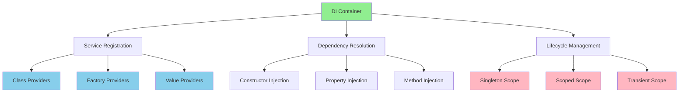
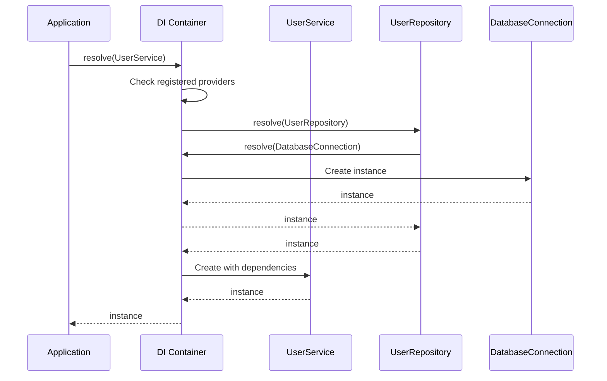

# Dependency Injection: Building Loosely Coupled Applications

Dependency Injection (DI) is a core principle of @framework/core. It enables you to build applications where classes don't create their own dependencies, but instead receive them from an external container. This promotes loose coupling, testability, and maintainability across your entire application.

## What is Dependency Injection?

Dependency Injection is a design pattern that deals with how components get hold of their dependencies. The basic idea is that a class should receive its dependencies from external sources rather than creating them itself.

### Without Dependency Injection

```typescript
@Injectable()
export class UserService {
  private database: DatabaseConnection;
  private logger: LoggerService;

  constructor() {
    // ❌ Service creates its own dependencies
    this.database = new DatabaseConnection(
      'localhost',
      5432,
      'password'
    );
    this.logger = new LoggerService();
  }

  async getUser(id: number) {
    this.logger.log(`Fetching user ${id}`);
    return this.database.query(`SELECT * FROM users WHERE id = ?`, [id]);
  }
}
```

Problems:
- **Hard to test** - Can't replace DatabaseConnection with a mock
- **Tight coupling** - UserService is tightly bound to specific implementations
- **Hard to configure** - Connection settings are hardcoded
- **Duplicate initialization** - Every class creates its own instances

### With Dependency Injection

```typescript
@Injectable()
export class UserService {
  constructor(
    private readonly database: DatabaseConnection,
    private readonly logger: LoggerService,
  ) {
    // ✅ Dependencies are injected by the container
  }

  async getUser(id: number) {
    this.logger.log(`Fetching user ${id}`);
    return this.database.query(`SELECT * FROM users WHERE id = ?`, [id]);
  }
}
```

Benefits:
- **Easy to test** - Can inject mock implementations
- **Loose coupling** - Service depends on abstractions, not concrete classes
- **Flexible configuration** - Change implementations without modifying the service
- **Shared instances** - Container manages creation and lifecycle

## DI Container Overview

The DI container is responsible for:
1. **Creating instances** - Instantiates dependencies based on registration
2. **Resolving dependencies** - Automatically injects required dependencies
3. **Managing lifecycles** - Controls when instances are created and destroyed
4. **Handling scopes** - Manages singleton, scoped, and transient instances



## Service Registration Patterns

Services must be registered with the container before they can be injected. The framework provides multiple registration patterns for different scenarios.

### 1. Class Provider

Register a class that will be instantiated by the container:

```typescript
@Injectable()
export class UserService {
  getUsers() {
    return [{ id: 1, name: 'Alice' }];
  }
}

@Module({
  providers: [UserService],
})
export class UserModule {}

// Usage in a controller:
@Controller('/users')
export class UserController {
  constructor(private readonly userService: UserService) {}

  @Get()
  getAll() {
    return this.userService.getUsers();
  }
}
```

### 2. Factory Provider

Register a factory function that creates the service:

```typescript
@Module({
  providers: [
    {
      provide: 'DATABASE_CONNECTION',
      useFactory: async (configService: ConfigService) => {
        const config = configService.getDatabaseConfig();
        const connection = await createConnection(config);
        return connection;
      },
      inject: [ConfigService],
    },
  ],
})
export class DatabaseModule {}

// Usage with @Inject decorator:
@Injectable()
export class UserRepository {
  constructor(
    @Inject('DATABASE_CONNECTION')
    private readonly database: DatabaseConnection,
  ) {}

  async findById(id: number) {
    return this.database.query('SELECT * FROM users WHERE id = ?', [id]);
  }
}
```

### 3. Value Provider

Register a static value:

```typescript
const CONFIG = {
  apiUrl: 'https://api.example.com',
  timeout: 5000,
  maxRetries: 3,
};

@Module({
  providers: [
    {
      provide: 'APP_CONFIG',
      useValue: CONFIG,
    },
  ],
})
export class AppModule {}

// Usage:
@Injectable()
export class ApiService {
  constructor(
    @Inject('APP_CONFIG') private readonly config: AppConfig,
  ) {}

  async request(endpoint: string) {
    return fetch(`${this.config.apiUrl}${endpoint}`, {
      timeout: this.config.timeout,
    });
  }
}
```

## Injection Methods

Services can receive dependencies in multiple ways. Choose the method that best fits your use case.

### Constructor Injection

The most common pattern - dependencies are provided through the constructor:

```typescript
@Injectable()
export class OrderService {
  constructor(
    private readonly userRepository: UserRepository,
    private readonly productRepository: ProductRepository,
    private readonly paymentService: PaymentService,
  ) {}

  async createOrder(userId: number, productIds: number[]) {
    const user = await this.userRepository.findById(userId);
    const products = await this.productRepository.findByIds(productIds);
    const total = products.reduce((sum, p) => sum + p.price, 0);

    if (user && products.length > 0) {
      await this.paymentService.charge(user.id, total);
      return { userId, products, total, status: 'completed' };
    }
  }
}
```

**Best for:** Required dependencies that are always needed.

### Property Injection

Dependencies are set as public properties using the `@Inject()` decorator:

```typescript
@Injectable()
export class EmailService {
  @Inject('SMTP_CONFIG')
  private smtpConfig: SmtpConfig;

  @Inject()
  private logger: LoggerService;

  async sendEmail(to: string, subject: string, body: string) {
    try {
      this.logger.log(`Sending email to ${to}`);
      // Send email using this.smtpConfig...
    } catch (error) {
      this.logger.error(`Failed to send email: ${error.message}`);
    }
  }
}
```

**Best for:** Optional dependencies or when initialization timing matters.

### Method Injection

Dependencies are provided when calling a method:

```typescript
@Injectable()
export class ReportService {
  generateReport(
    dataSource: DataSourceService,
    formatter: FormatterService,
    filter?: FilterService,
  ) {
    const data = dataSource.fetch();
    const formatted = formatter.format(data);
    
    if (filter) {
      return filter.apply(formatted);
    }
    
    return formatted;
  }
}
```

**Best for:** Method-specific dependencies or optional parameters.

## Dependency Resolution Flow

Understanding how the container resolves dependencies helps you design better applications:



## Circular Dependencies

Circular dependencies occur when services depend on each other, directly or indirectly. The framework detects these and provides clear error messages.

### Detecting Circular Dependencies

```typescript
// ❌ Direct circular dependency
@Injectable()
export class ServiceA {
  constructor(private readonly serviceB: ServiceB) {}
}

@Injectable()
export class ServiceB {
  constructor(private readonly serviceA: ServiceA) {}
}

// Error: Circular dependency detected: ServiceA → ServiceB → ServiceA
```

### Resolving with forwardRef()

Use `forwardRef()` when you have a legitimate circular dependency:

```typescript
import { forwardRef } from '@framework/core';

@Injectable()
export class UserService {
  constructor(
    @Inject(forwardRef(() => RoleService))
    private readonly roleService: RoleService,
  ) {}

  async getUserWithRole(userId: number) {
    const user = await this.findUser(userId);
    const role = await this.roleService.getRoleForUser(userId);
    return { ...user, role };
  }
}

@Injectable()
export class RoleService {
  constructor(private readonly userService: UserService) {}

  async getusersWithRole(roleId: number) {
    const users = await this.findUsersWithRole(roleId);
    // This can safely call userService methods
    return users.map(user => ({
      ...user,
      info: this.userService.getUserInfo(user.id),
    }));
  }
}
```

### Design Patterns to Avoid Cycles

**Pattern 1: Extract Common Dependency**

```typescript
// ❌ Circular
@Injectable()
export class OrderService {
  constructor(private readonly invoiceService: InvoiceService) {}
}

@Injectable()
export class InvoiceService {
  constructor(private readonly orderService: OrderService) {}
}

// ✅ Solution: Extract shared logic
@Injectable()
export class OrderUtility {
  // Shared logic
}

@Injectable()
export class OrderService {
  constructor(private readonly utility: OrderUtility) {}
}

@Injectable()
export class InvoiceService {
  constructor(private readonly utility: OrderUtility) {}
}
```

**Pattern 2: Inject Container**

```typescript
// ✅ Lazy resolution using container
@Injectable()
export class ServiceA {
  constructor(private readonly container: DIContainer) {}

  doSomething() {
    // Resolve ServiceB on demand
    const serviceB = this.container.resolve(ServiceB);
    return serviceB.method();
  }
}

@Injectable()
export class ServiceB {
  constructor(private readonly serviceA: ServiceA) {}
}
```

## Testing with Dependency Injection

The DI system makes testing straightforward. You can inject mock implementations for testing:

### Basic Mock Provider

```typescript
import { describe, it, expect, beforeEach } from '@jest/globals';

describe('UserService', () => {
  let userService: UserService;
  let mockRepository: UserRepository;

  beforeEach(() => {
    mockRepository = {
      findById: jest.fn().mockResolvedValue({ id: 1, name: 'Alice' }),
      findAll: jest.fn().mockResolvedValue([{ id: 1, name: 'Alice' }]),
    } as unknown as UserRepository;

    userService = new UserService(mockRepository);
  });

  it('should fetch a user by id', async () => {
    const user = await userService.getUserById(1);
    expect(user.name).toBe('Alice');
    expect(mockRepository.findById).toHaveBeenCalledWith(1);
  });

  it('should fetch all users', async () => {
    const users = await userService.getAllUsers();
    expect(users).toHaveLength(1);
  });
});
```

### Test Doubles: Stubs, Mocks, Spies

```typescript
describe('OrderService with test doubles', () => {
  let orderService: OrderService;

  // Stub: Returns hardcoded values
  const stubPaymentService = {
    charge: jest.fn().mockResolvedValue({ success: true }),
  };

  // Mock: Verifies interactions
  const mockInventoryService = {
    reserve: jest.fn().mockResolvedValue(true),
    release: jest.fn().mockResolvedValue(true),
  };

  // Spy: Wraps real implementation
  const realUserService = new UserService(mockRepository);
  const spyUserService = jest.spyOn(realUserService, 'validateUser');

  beforeEach(() => {
    jest.clearAllMocks();
  });

  it('should charge payment and reserve inventory', async () => {
    orderService = new OrderService(
      stubPaymentService as any,
      mockInventoryService as any,
    );

    await orderService.createOrder({ userId: 1, items: [] });

    expect(stubPaymentService.charge).toHaveBeenCalled();
    expect(mockInventoryService.reserve).toHaveBeenCalled();
  });

  it('should validate user before order', async () => {
    orderService = new OrderService(
      stubPaymentService as any,
      mockInventoryService as any,
      spyUserService,
    );

    await orderService.createOrder({ userId: 1, items: [] });

    expect(spyUserService.validateUser).toHaveBeenCalledWith(1);
  });
});
```

### Complete Test Example with Module

```typescript
import { Application, Module, Injectable } from '@framework/core';

@Injectable()
export class EmailService {
  async send(to: string, message: string) {
    // Simulate email sending
    return { sent: true, to, message };
  }
}

@Module({
  providers: [EmailService],
  exports: [EmailService],
})
export class EmailModule {}

describe('Email workflow with mocks', () => {
  let app: Application;
  let emailService: EmailService;

  beforeEach(async () => {
    app = new Application();
    await app.registerModule(EmailModule);
    emailService = app.resolve(EmailService);
  });

  it('should send email successfully', async () => {
    const spy = jest.spyOn(emailService, 'send');
    
    const result = await emailService.send(
      'user@example.com',
      'Welcome!'
    );

    expect(result.sent).toBe(true);
    expect(spy).toHaveBeenCalledWith('user@example.com', 'Welcome!');
  });
});
```

## Advanced Patterns

### Multi-Providers (resolveAll)

Register multiple implementations for the same token and resolve all:

```typescript
@Module({
  providers: [
    {
      provide: 'LOGGER',
      useClass: ConsoleLogger,
    },
    {
      provide: 'LOGGER',
      useClass: FileLogger,
    },
    {
      provide: 'LOGGER',
      useClass: RemoteLogger,
    },
  ],
})
export class LoggingModule {}

// Usage:
@Injectable()
export class AppService {
  constructor(
    @Inject('LOGGER')
    private readonly loggers: LoggerService[],
  ) {}

  logToAll(message: string) {
    this.loggers.forEach(logger => logger.log(message));
  }
}
```

### Async Factory Providers

Perform async initialization during dependency resolution:

```typescript
@Module({
  providers: [
    {
      provide: 'CACHE_CLIENT',
      useFactory: async (configService: ConfigService) => {
        const config = configService.getCacheConfig();
        const redis = new RedisClient(config);
        await redis.connect();
        return redis;
      },
      inject: [ConfigService],
    },
  ],
})
export class CacheModule {}

// The container waits for async initialization
@Injectable()
export class UserCacheService {
  constructor(
    @Inject('CACHE_CLIENT')
    private readonly cache: RedisClient,
  ) {
    // cache is guaranteed to be connected
  }
}
```

### Dynamic Provider Registration

Register providers at runtime:

```typescript
@Injectable()
export class PluginService {
  constructor(private readonly container: DIContainer) {}

  async loadPlugin(pluginName: string) {
    const plugin = await import(`./plugins/${pluginName}`);

    // Register plugin services dynamically
    this.container.register({
      provide: pluginName,
      useClass: plugin.PluginService,
    });

    return this.container.resolve(pluginName);
  }
}
```

## Best Practices

### 1. Depend on Abstractions, Not Implementations

Use interfaces or abstract classes to decouple services:

```typescript
// ✅ Good: Depend on interface
interface IUserRepository {
  findById(id: number): Promise<User>;
  save(user: User): Promise<void>;
}

@Injectable()
export class UserService {
  constructor(private readonly repo: IUserRepository) {}
}

// ❌ Avoid: Depend on concrete class
@Injectable()
export class UserService {
  constructor(private readonly repo: PostgresUserRepository) {}
}
```

### 2. Keep Constructor Parameters Reasonable

Limit constructor parameters to maintain readability:

```typescript
// ✅ Good: Grouped related dependencies
@Injectable()
export class OrderService {
  constructor(
    private readonly repositories: OrderRepositories, // Grouped
    private readonly services: OrderServices,          // Grouped
  ) {}
}

// ❌ Avoid: Too many parameters
@Injectable()
export class OrderService {
  constructor(
    private readonly userRepo: UserRepository,
    private readonly productRepo: ProductRepository,
    private readonly orderRepo: OrderRepository,
    private readonly paymentService: PaymentService,
    private readonly notificationService: NotificationService,
    private readonly loggerService: LoggerService,
    private readonly configService: ConfigService,
  ) {}
}
```

### 3. Validate Dependencies in Tests

Always verify that mocked dependencies are called as expected:

```typescript
it('should inject and use dependencies correctly', async () => {
  const mockRepo = {
    findById: jest.fn().mockResolvedValue({ id: 1, name: 'Test' }),
  };

  const service = new UserService(mockRepo as any);
  await service.getUser(1);

  // Verify the dependency was used
  expect(mockRepo.findById).toHaveBeenCalledWith(1);
});
```

### 4. Use Named Tokens for Configuration

Avoid string literals scattered throughout your code:

```typescript
// ✅ Good: Named constants
export const DATABASE_CONNECTION = Symbol('DATABASE_CONNECTION');
export const CACHE_CONFIG = Symbol('CACHE_CONFIG');
export const JWT_SECRET = Symbol('JWT_SECRET');

@Module({
  providers: [
    { provide: DATABASE_CONNECTION, useValue: connection },
    { provide: CACHE_CONFIG, useValue: config },
    { provide: JWT_SECRET, useValue: secret },
  ],
})
export class CoreModule {}

// ❌ Avoid: Scattered string literals
@Inject('database_connection')
@Inject('cache_config')
@Inject('jwt_secret')
```

### 5. Document Complex Dependencies

Add comments explaining why dependencies are needed:

```typescript
@Injectable()
export class ReportService {
  constructor(
    // DataService provides raw data from multiple sources
    private readonly dataService: DataService,
    
    // FormatterService handles different output formats (PDF, CSV, Excel)
    private readonly formatterService: FormatterService,
    
    // CacheService caches expensive report generations
    private readonly cacheService: CacheService,
  ) {}
}
```

## Summary

Dependency Injection is a powerful pattern that makes your applications more:

- **Testable** - Easy to inject mocks and test doubles
- **Maintainable** - Clear dependencies between services
- **Flexible** - Swap implementations without changing code
- **Scalable** - Works equally well in small and large applications

Master these concepts to build robust, well-structured @framework/core applications:

- **Register services** using class, factory, and value providers
- **Inject dependencies** using constructor, property, and method injection
- **Resolve circular dependencies** with forwardRef or design patterns
- **Test thoroughly** using mocks, stubs, and spies
- **Follow best practices** like depending on abstractions and validating dependencies
