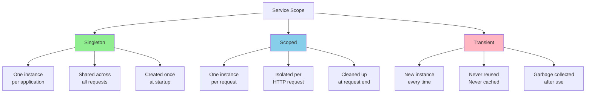

# Scopes: Managing Service Lifecycles

Service scopes determine how long instances live and how they're shared across your application. @framework/core provides three scope types: **Singleton**, **Scoped**, and **Transient**. Choosing the right scope for each service is critical for performance, memory usage, and correct application behavior.

## Scope Overview

Every service in your application has a lifecycle scope that controls:
1. **When instances are created** - On first request, per request, or every time
2. **How instances are shared** - Across the entire app, per request, or never
3. **When instances are destroyed** - At shutdown, at request end, or immediately after use



## Singleton Scope

A singleton service has one instance that lives for the entire application lifetime. All requests and components share the same instance.

### When to Use Singleton

- **Configuration services** - Hold application config that never changes
- **Database connections** - Expensive to create, reused across requests
- **Caches** - Shared data cached in memory for performance
- **Loggers** - Central logging service
- **Event emitters** - Application-wide event bus
- **Connection pools** - Manage reusable database or HTTP connections

### Singleton Example

```typescript
import { Injectable } from '@framework/core';

@Injectable({ scope: 'singleton' })
export class ConfigService {
  private config: AppConfig;

  constructor() {
    this.config = this.loadConfig();
  }

  private loadConfig(): AppConfig {
    return {
      apiUrl: process.env.API_URL || 'http://localhost:3000',
      database: {
        host: process.env.DB_HOST || 'localhost',
        port: parseInt(process.env.DB_PORT || '5432', 10),
        name: process.env.DB_NAME || 'app',
      },
      jwt: {
        secret: process.env.JWT_SECRET,
        expiresIn: '24h',
      },
    };
  }

  getConfig(): AppConfig {
    return this.config;
  }

  getDatabaseConfig() {
    return this.config.database;
  }

  getJwtSecret() {
    return this.config.jwt.secret;
  }
}

// Module registration
@Module({
  providers: [
    {
      provide: ConfigService,
      useClass: ConfigService,
      scope: 'singleton', // Explicitly singleton
    },
  ],
  exports: [ConfigService],
})
export class CoreModule {}
```

### Singleton Database Connection

```typescript
@Injectable({ scope: 'singleton' })
export class DatabaseService {
  private connection: any;
  private isConnected = false;

  async connect(): Promise<void> {
    if (this.isConnected) {
      return; // Already connected
    }

    try {
      this.connection = await createPool({
        host: 'localhost',
        port: 5432,
        database: 'myapp',
        max: 10, // Connection pool size
      });

      this.isConnected = true;
      console.log('Database connected (singleton)');
    } catch (error) {
      console.error('Database connection failed:', error);
      throw error;
    }
  }

  query(sql: string, params: any[] = []) {
    if (!this.isConnected) {
      throw new Error('Database not connected');
    }
    return this.connection.query(sql, params);
  }

  async disconnect(): Promise<void> {
    if (this.isConnected) {
      await this.connection.end();
      this.isConnected = false;
    }
  }
}

// Usage in any service - all share the same connection
@Injectable()
export class UserRepository {
  constructor(private readonly db: DatabaseService) {}

  async findById(id: number) {
    return this.db.query('SELECT * FROM users WHERE id = ?', [id]);
  }
}
```

### Thread Safety and Singleton

Singletons must be thread-safe since multiple requests access them simultaneously:

```typescript
@Injectable({ scope: 'singleton' })
export class CacheService {
  // ✅ Thread-safe: Map is thread-safe in Node.js single-threaded model
  private cache: Map<string, any> = new Map();

  // ✅ Thread-safe: Mutations are atomic
  set(key: string, value: any, ttl?: number): void {
    this.cache.set(key, { value, expiresAt: ttl ? Date.now() + ttl : null });
  }

  // ✅ Thread-safe: Read operations
  get(key: string): any {
    const item = this.cache.get(key);
    if (!item) return null;

    if (item.expiresAt && Date.now() > item.expiresAt) {
      this.cache.delete(key);
      return null;
    }

    return item.value;
  }

  // ❌ NOT thread-safe: Complex operations need locking
  async incrementCounter(key: string): Promise<number> {
    // Race condition: multiple requests could read old value
    const current = this.cache.get(key) ?? 0;
    const updated = current + 1;
    this.cache.set(key, updated);
    return updated;
  }

  // ✅ Thread-safe with locking
  async incrementCounterSafe(key: string): Promise<number> {
    // Use atomic operations or Mutex for thread safety
    return new Promise((resolve) => {
      // Implement atomic increment...
      resolve(0);
    });
  }
}
```

## Scoped Scope

A scoped service creates one instance per HTTP request. Each request gets its own isolated instance that's cleaned up when the request completes.

### When to Use Scoped

- **Request context** - User information, request ID, headers
- **Database transactions** - Scope transaction to request lifetime
- **Repository instances** - Each request has isolated data access
- **User session** - Authentication context per request
- **Request-specific caches** - Temporary caches for duration of request

### Scoped Example

```typescript
import { Injectable, Scope } from '@framework/core';

@Injectable({ scope: 'scoped' })
export class RequestContextService {
  private requestId: string;
  private userId?: number;
  private startTime: number;

  constructor() {
    // Each request gets a new instance
    this.requestId = generateRequestId();
    this.startTime = Date.now();
    console.log(`[${this.requestId}] Request started`);
  }

  getRequestId(): string {
    return this.requestId;
  }

  setUserId(userId: number): void {
    this.userId = userId;
  }

  getUserId(): number | undefined {
    return this.userId;
  }

  getDuration(): number {
    return Date.now() - this.startTime;
  }

  log(message: string): void {
    console.log(`[${this.requestId}] ${message}`);
  }
}

// Usage in multiple services - each request gets same instance
@Injectable()
export class UserService {
  constructor(
    private readonly requestContext: RequestContextService,
    private readonly userRepository: UserRepository,
  ) {}

  async getUser(id: number) {
    this.requestContext.log('Fetching user');
    const user = await this.userRepository.findById(id);
    return user;
  }
}

@Injectable()
export class ProductService {
  constructor(private readonly requestContext: RequestContextService) {}

  async getProducts() {
    // Same RequestContextService instance as UserService
    this.requestContext.log('Fetching products');
    return [];
  }
}
```

### Scoped with AsyncLocalStorage

@framework/core uses `AsyncLocalStorage` to isolate scoped services per request:

```typescript
import { AsyncLocalStorage } from 'async_hooks';

const requestContextStorage = new AsyncLocalStorage<RequestContext>();

@Injectable({ scope: 'scoped' })
export class RequestContext {
  private requestId: string;
  private userId?: number;

  constructor() {
    this.requestId = generateRequestId();
  }

  getRequestId(): string {
    return this.requestId;
  }

  setUserId(userId: number): void {
    this.userId = userId;
  }
}

// Framework automatically handles this:
// 1. Create new RequestContext instance
// 2. Store in AsyncLocalStorage
// 3. Make available to all services in request
// 4. Clean up when request completes
```

### Scoped Transaction Pattern

```typescript
@Injectable({ scope: 'scoped' })
export class TransactionService {
  private transaction: any;
  private isActive = false;

  async begin(): Promise<void> {
    this.transaction = await this.db.beginTransaction();
    this.isActive = true;
  }

  async commit(): Promise<void> {
    if (this.isActive) {
      await this.transaction.commit();
      this.isActive = false;
    }
  }

  async rollback(): Promise<void> {
    if (this.isActive) {
      await this.transaction.rollback();
      this.isActive = false;
    }
  }

  query(sql: string, params: any[]) {
    if (!this.isActive) {
      throw new Error('Transaction not active');
    }
    return this.transaction.query(sql, params);
  }
}

// Usage in a controller
@Controller('/orders')
export class OrderController {
  constructor(
    private readonly orderService: OrderService,
    private readonly transactionService: TransactionService,
  ) {}

  @Post()
  async createOrder(@Body() createOrderDto: CreateOrderDto) {
    try {
      await this.transactionService.begin();
      
      const order = await this.orderService.create(createOrderDto);
      
      await this.transactionService.commit();
      return order;
    } catch (error) {
      await this.transactionService.rollback();
      throw error;
    }
  }
}
```

### Testing Scoped Services

```typescript
import { AsyncLocalStorage } from 'async_hooks';

describe('Scoped services', () => {
  let requestContext1: RequestContextService;
  let requestContext2: RequestContextService;

  // Simulate separate requests
  it('should isolate scoped services per request', async () => {
    const contextStorage = new AsyncLocalStorage();

    // Request 1
    const result1 = await new Promise((resolve) => {
      contextStorage.run({}, async () => {
        const context = new RequestContextService();
        context.setRequestId('req-1');
        resolve(context.getRequestId());
      });
    });

    // Request 2
    const result2 = await new Promise((resolve) => {
      contextStorage.run({}, async () => {
        const context = new RequestContextService();
        context.setRequestId('req-2');
        resolve(context.getRequestId());
      });
    });

    expect(result1).toBe('req-1');
    expect(result2).toBe('req-2');
  });

  it('should share scoped service within same request', async () => {
    const contextStorage = new AsyncLocalStorage();

    const results = await new Promise((resolve) => {
      contextStorage.run({}, async () => {
        const userService = new UserService(
          new RequestContextService(),
          new UserRepository(),
        );

        const productService = new ProductService(
          // This should be the same instance
          new RequestContextService(),
        );

        resolve({
          user: userService.constructor.name,
          product: productService.constructor.name,
        });
      });
    });

    expect(results).toBeDefined();
  });
});
```

## Transient Scope

A transient service creates a new instance every time it's requested. Instances are never cached or reused.

### When to Use Transient

- **DTOs and value objects** - Data containers that shouldn't be reused
- **Stateful utility classes** - Fresh state for each operation
- **One-time use services** - Build something and discard
- **Request handlers** - Isolated handlers for each request
- **Factory-like services** - Create new objects on demand

### Transient Example

```typescript
import { Injectable, Scope } from '@framework/core';

@Injectable({ scope: 'transient' })
export class CsvExporter {
  private rows: string[] = [];

  addRow(data: Record<string, any>): void {
    const values = Object.values(data).map(v =>
      typeof v === 'string' ? `"${v}"` : v
    );
    this.rows.push(values.join(','));
  }

  export(): string {
    return this.rows.join('\n');
  }
}

// Usage in controller
@Controller('/export')
export class ExportController {
  constructor(private readonly csvExporter: CsvExporter) {}

  @Get('/users')
  async exportUsers() {
    // New CsvExporter instance for this request
    this.csvExporter.addRow({ name: 'Alice', age: 30 });
    this.csvExporter.addRow({ name: 'Bob', age: 25 });
    return this.csvExporter.export();
  }

  @Get('/products')
  async exportProducts() {
    // Different CsvExporter instance
    // Doesn't include user data from previous request
    this.csvExporter.addRow({ name: 'Laptop', price: 999 });
    return this.csvExporter.export();
  }
}
```

### Transient Performance Considerations

```typescript
// ❌ Bad: Creating heavy objects constantly
@Injectable({ scope: 'transient' })
export class RegexMatcher {
  private regex: RegExp;

  constructor(pattern: string) {
    // Regex compilation is expensive - creates new for every instance
    this.regex = new RegExp(pattern);
  }

  match(input: string): boolean {
    return this.regex.test(input);
  }
}

// ✅ Better: Pre-compile and use singleton
@Injectable({ scope: 'singleton' })
export class RegexMatcher {
  private patterns: Map<string, RegExp> = new Map();

  getPattern(pattern: string): RegExp {
    if (!this.patterns.has(pattern)) {
      this.patterns.set(pattern, new RegExp(pattern));
    }
    return this.patterns.get(pattern)!;
  }

  match(pattern: string, input: string): boolean {
    return this.getPattern(pattern).test(input);
  }
}
```

## Scope Conflicts and Resolutions

Services of different scopes have visibility rules - a service can only depend on services in the same or wider scope.

### Scope Hierarchy

```
Singleton (widest)
    ↓
Scoped
    ↓
Transient (narrowest)
```

### Valid Dependencies

```
Singleton   → Singleton        ✅
Singleton   → Scoped           ❌ ERROR
Singleton   → Transient        ✅

Scoped      → Singleton        ✅
Scoped      → Scoped           ✅
Scoped      → Transient        ✅

Transient   → Singleton        ✅
Transient   → Scoped           ✅
Transient   → Transient        ✅
```

### Singleton Depending on Scoped (Error)

```typescript
// ❌ ERROR: Singleton cannot depend on Scoped
@Injectable({ scope: 'singleton' })
export class UserCache {
  private cache: Map<number, User> = new Map();

  constructor(
    private readonly requestContext: RequestContextService, // Scoped!
  ) {
    // Problem: requestContext is per-request but cache is global
    // Multiple requests would overwrite each other's data
  }

  cacheUser(user: User): void {
    this.cache.set(user.id, user);
  }
}

// Fix 1: Make cache scoped
@Injectable({ scope: 'scoped' })
export class UserCache {
  private cache: Map<number, User> = new Map();

  constructor(
    private readonly requestContext: RequestContextService,
  ) {}
}

// Fix 2: Inject factory instead
@Injectable({ scope: 'singleton' })
export class UserCacheFactory {
  constructor(private readonly contextFactory: ContextFactory) {}

  getCache() {
    // Get current request's cache
    return this.contextFactory.getCurrent().userCache;
  }
}

// Fix 3: Lazy inject with forwardRef
@Injectable({ scope: 'singleton' })
export class UserCache {
  constructor(
    @Inject(forwardRef(() => RequestContextService))
    private readonly requestContext: RequestContextService,
  ) {}
}
```

### Singleton Depending on Transient (OK)

```typescript
// ✅ OK: Each call creates new instance
@Injectable({ scope: 'singleton' })
export class ReportGenerator {
  constructor(
    private readonly csvFormatter: CsvFormatter, // Transient
  ) {}

  async generate(data: any[]) {
    // Each call to csvFormatter gets a fresh instance
    const csv = await this.csvFormatter.format(data);
    return csv;
  }
}

@Injectable({ scope: 'transient' })
export class CsvFormatter {
  async format(data: any[]): Promise<string> {
    // Fresh instance with clean state
    return data.map(row => Object.values(row).join(',')).join('\n');
  }
}
```

### Diagnosing Scope Mismatches

```typescript
// Error message:
// "InvalidScopeError: Service UserCache (singleton) cannot depend on 
// RequestContext (scoped) because scoped services are shorter-lived"

// Solution checklist:
// 1. Can service be scoped instead of singleton?
// 2. Can dependent service be transient?
// 3. Should you inject a factory?
// 4. Should you use lazy injection with forwardRef()?
```

## Testing Scoped Services

Testing scoped services requires simulating request context:

### Manual Scope Creation

```typescript
import { DIContainer, Scope } from '@framework/core';

describe('Scoped service testing', () => {
  let container: DIContainer;

  beforeEach(() => {
    container = new DIContainer();
    container.register(RequestContextService, { scope: 'scoped' });
    container.register(UserService, { scope: 'scoped' });
  });

  it('should create isolated scoped instances', () => {
    // Create scope 1
    const scope1 = container.createScope();
    const context1 = scope1.resolve(RequestContextService);
    context1.setRequestId('req-1');

    // Create scope 2
    const scope2 = container.createScope();
    const context2 = scope2.resolve(RequestContextService);
    context2.setRequestId('req-2');

    expect(context1.getRequestId()).toBe('req-1');
    expect(context2.getRequestId()).toBe('req-2');
    expect(context1).not.toBe(context2); // Different instances
  });

  it('should share scoped instances within same scope', () => {
    const scope = container.createScope();
    const userService = scope.resolve(UserService);
    const context = scope.resolve(RequestContextService);

    // Both resolved from same scope - should share RequestContextService
    expect(userService.context).toBe(context);
  });
});
```

### Simulating Request Context

```typescript
import { AsyncLocalStorage } from 'async_hooks';

const contextStorage = new AsyncLocalStorage<RequestScope>();

describe('Request context simulation', () => {
  it('should isolate context across simulated requests', async () => {
    const request1 = new Promise<void>((resolve) => {
      contextStorage.run({}, async () => {
        const context = new RequestContextService();
        context.setUserId(1);

        // Simulate some work
        await new Promise(r => setTimeout(r, 10));

        expect(context.getUserId()).toBe(1); // Still 1, not affected by request2
        resolve();
      });
    });

    const request2 = new Promise<void>((resolve) => {
      contextStorage.run({}, async () => {
        const context = new RequestContextService();
        context.setUserId(2);

        // Simulate some work
        await new Promise(r => setTimeout(r, 5));

        expect(context.getUserId()).toBe(2); // Still 2, not affected by request1
        resolve();
      });
    });

    await Promise.all([request1, request2]);
  });
});
```

### Complete Test Example

```typescript
describe('UserService with scoped dependencies', () => {
  let userService: UserService;
  let userRepository: UserRepository;
  let requestContext: RequestContextService;
  let scope: DIScope;

  beforeEach(() => {
    const container = new DIContainer();
    
    // Register all dependencies as scoped for testing
    container.register(RequestContextService, { scope: 'scoped' });
    container.register(UserRepository, { scope: 'scoped' });
    container.register(UserService, { scope: 'scoped' });

    // Create isolated scope
    scope = container.createScope();

    userService = scope.resolve(UserService);
    userRepository = scope.resolve(UserRepository);
    requestContext = scope.resolve(RequestContextService);
  });

  it('should share request context across services', () => {
    requestContext.setUserId(123);

    // UserService can access same context
    expect(userService.getRequestContext().getUserId()).toBe(123);
  });

  it('should isolate context between requests', async () => {
    const scope1 = createScope();
    const scope2 = createScope();

    const context1 = scope1.resolve(RequestContextService);
    const context2 = scope2.resolve(RequestContextService);

    context1.setUserId(1);
    context2.setUserId(2);

    expect(context1.getUserId()).toBe(1);
    expect(context2.getUserId()).toBe(2);
    expect(context1).not.toBe(context2);
  });

  it('should clean up scope after request', async () => {
    const tempScope = createScope();
    const tempContext = tempScope.resolve(RequestContextService);

    expect(tempContext).toBeDefined();

    // Clean up
    tempScope.destroy();

    // Should fail or return undefined
    expect(() => tempScope.resolve(RequestContextService)).toThrow();
  });
});
```

## Real-World Patterns

### Database Transaction Scope

```typescript
@Injectable({ scope: 'scoped' })
export class TransactionContext implements OnDestroy {
  private transaction: any;

  async initialize(db: Database): Promise<void> {
    this.transaction = await db.beginTransaction();
  }

  async commit(): Promise<void> {
    await this.transaction.commit();
  }

  async rollback(): Promise<void> {
    await this.transaction.rollback();
  }

  execute(query: string, params: any[]) {
    return this.transaction.execute(query, params);
  }

  // Framework calls this when scope is destroyed
  async onDestroy(): Promise<void> {
    if (this.transaction.isActive) {
      await this.transaction.rollback();
    }
  }
}

@Module({
  providers: [TransactionContext],
  exports: [TransactionContext],
})
export class TransactionModule {}
```

### User Context Service

```typescript
@Injectable({ scope: 'scoped' })
export class UserContextService {
  private user: AuthenticatedUser | null = null;
  private permissions: Set<string> = new Set();

  setUser(user: AuthenticatedUser): void {
    this.user = user;
    this.loadPermissions(user.roles);
  }

  getUser(): AuthenticatedUser {
    if (!this.user) {
      throw new Error('User context not set');
    }
    return this.user;
  }

  can(permission: string): boolean {
    return this.permissions.has(permission);
  }

  private loadPermissions(roles: string[]): void {
    // Load permissions for roles
    roles.forEach(role => {
      // Add permissions...
    });
  }
}

@Middleware()
export class AuthMiddleware {
  constructor(private readonly userContext: UserContextService) {}

  async execute(req: Request, res: Response, next: NextFunction) {
    const token = req.headers.authorization;
    if (token) {
      const user = await verifyToken(token);
      this.userContext.setUser(user);
    }
    next();
  }
}
```

### Repository Service (Scoped)

```typescript
@Injectable({ scope: 'scoped' })
export class UserRepository {
  constructor(
    private readonly transaction: TransactionContext,
  ) {}

  async findById(id: number): Promise<User> {
    return this.transaction.execute('SELECT * FROM users WHERE id = ?', [id]);
  }

  async save(user: User): Promise<User> {
    return this.transaction.execute(
      'INSERT INTO users (...) VALUES (...)',
      [user.name, user.email],
    );
  }

  async delete(id: number): Promise<void> {
    return this.transaction.execute('DELETE FROM users WHERE id = ?', [id]);
  }
}
```

## Performance Tuning

### Scope Selection Impact

```
Singleton:
- Memory: Minimal (1 instance)
- CPU: Minimal (created once)
- Latency: Zero overhead
- Use for: Shared, expensive services

Scoped:
- Memory: Moderate (1 per request)
- CPU: Low (created per request)
- Latency: Small overhead (scope creation)
- Use for: Request-specific services

Transient:
- Memory: High (new per resolution)
- CPU: High (constant creation)
- Latency: Small overhead per resolution
- Use for: Stateful, short-lived services
```

### Memory Usage Comparison

```typescript
// Singleton: 1 instance × N requests = 1 instance in memory
@Injectable({ scope: 'singleton' })
export class ConfigService {
  private data: LargeConfig; // Shared across all requests
}

// Scoped: N instances × N requests = N instances in memory
@Injectable({ scope: 'scoped' })
export class RequestContext {
  private userId: number; // One per request
}

// Transient: N resolutions × N requests = N×M instances
@Injectable({ scope: 'transient' })
export class Builder {
  private state: BuilderState; // New each time
}

// Memory impact:
// 1000 requests, avg 5 scoped services: 5000 instances in memory
// vs singleton: 1 instance in memory
```

### Garbage Collection Implications

```typescript
// Singleton: Once created, never GC'd until app shutdown
@Injectable({ scope: 'singleton' })
export class Cache {
  private data: Map<string, any> = new Map();
  // Memory grows indefinitely without cleanup
}

// Scoped: GC'd when request completes
@Injectable({ scope: 'scoped' })
export class RequestBuffer {
  private data: Buffer; // Released when request ends
}

// Transient: GC'd immediately after use
@Injectable({ scope: 'transient' })
export class TempObject {
  // Eligible for GC as soon as no references exist
}
```

## Summary

Service scopes are fundamental to building correct and performant applications:

- **Singleton** - One instance per app lifetime, use for shared services
- **Scoped** - One instance per request, use for request-specific data
- **Transient** - New instance every time, use for stateful objects

Key principles:
- Match scope to service lifecycle
- Avoid scope conflicts
- Test scoped services with proper isolation
- Consider memory and performance implications
- Use scopes to enforce correct application patterns

With mastery of scopes, you'll build applications that are correct, performant, and easy to reason about.
