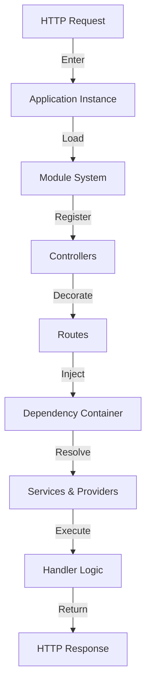
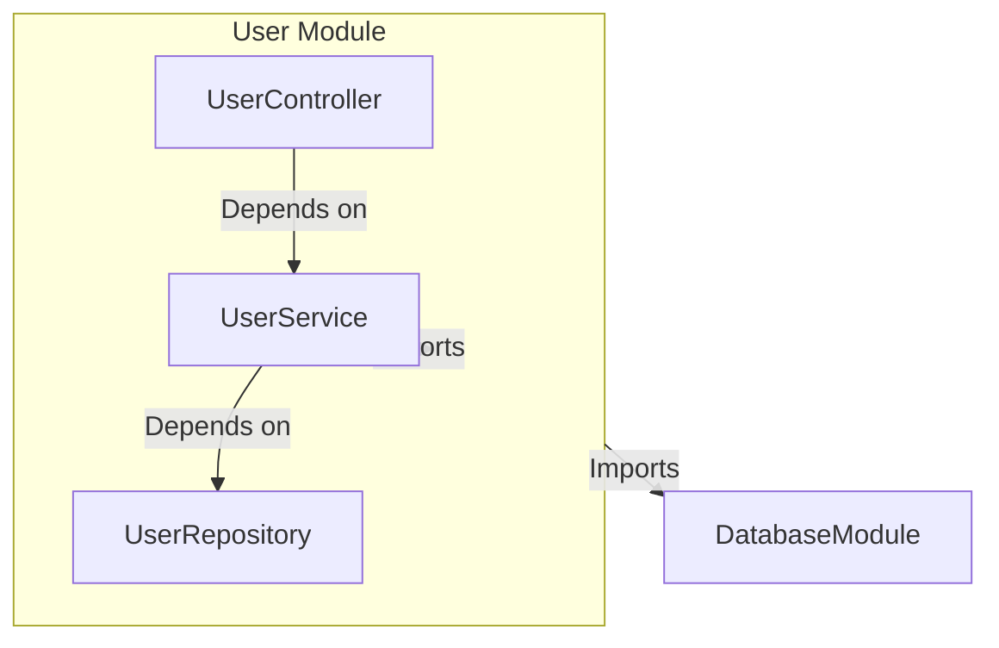
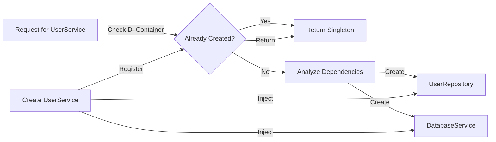
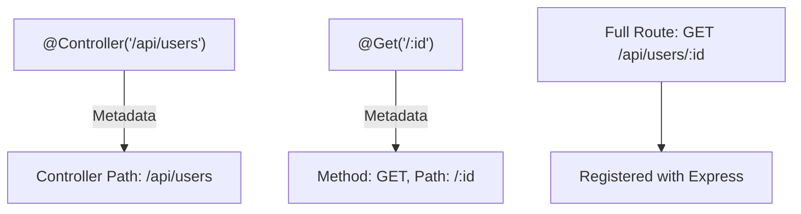
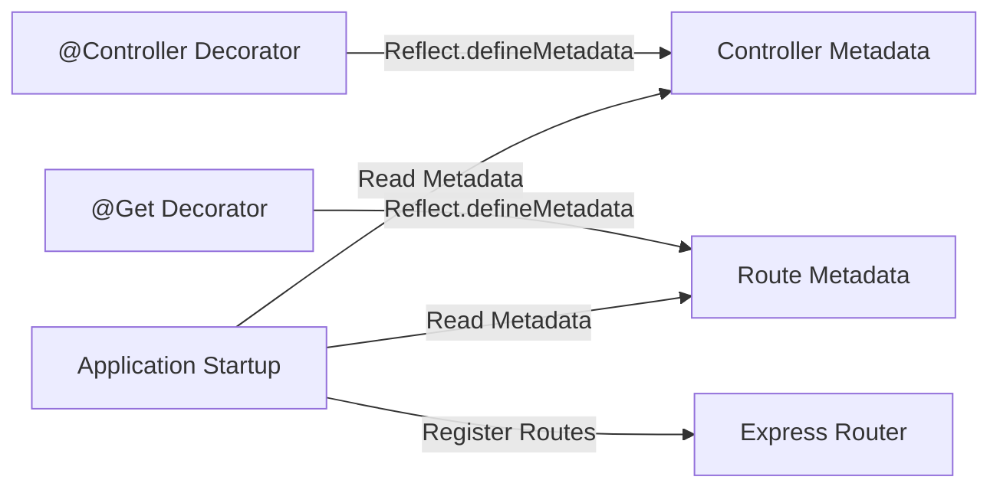
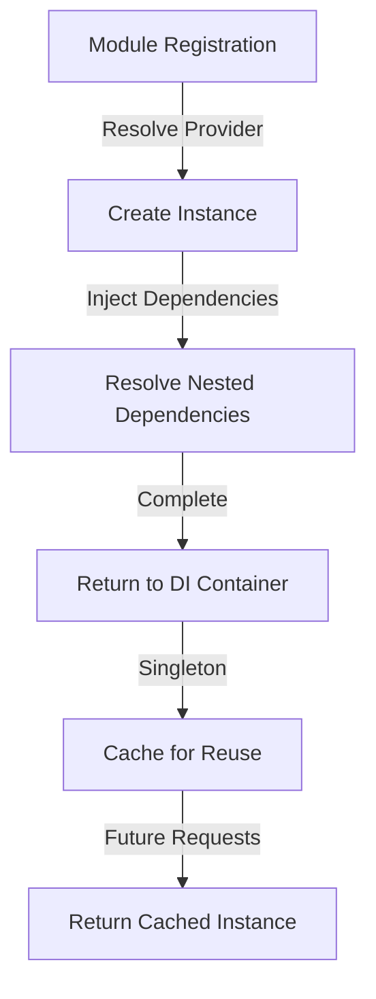
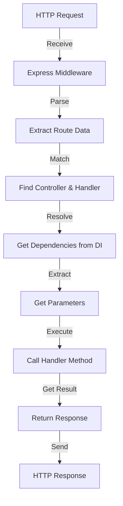
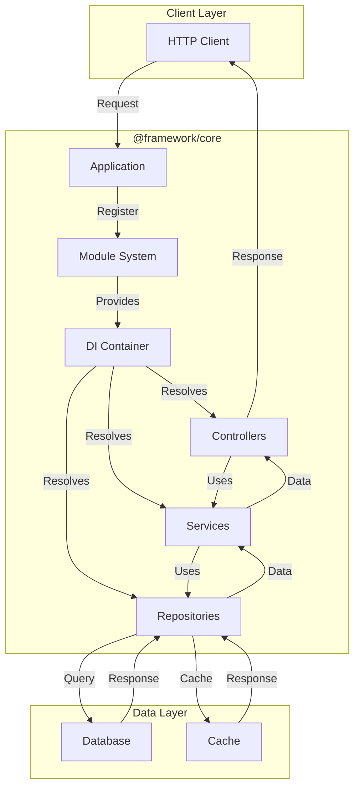
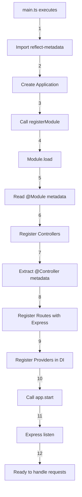

# Architecture Overview

@framework/core is built on a modular, layered architecture that promotes separation of concerns and scalability. This guide explains how the framework's components work together.

## System Overview

Here's how a request flows through the @framework/core system:



## Core Components

### 1. Application Class

The root of your application. Manages Express.js and module registration.

```typescript
import { Application } from '@framework/core';
import { UserModule } from './modules/users/user.module.js';

const app = new Application({
  port: 3000,
  host: 'localhost',
  corsEnabled: true,
});

await app.registerModule(UserModule);
await app.start();
```

**Responsibilities:**

- Create Express.js instance
- Register modules
- Setup middleware
- Manage application lifecycle
- Start HTTP server

**Key Methods:**

```typescript
async registerModule(moduleClass: Function): Promise<void>
useMiddleware(middleware: RequestHandler): void
useErrorHandler(handler: ErrorRequestHandler): void
async start(): Promise<void>
getExpressApp(): Express
```

### 2. Module System

Modules are organizational units that group related functionality.

```typescript
import { Module } from '@framework/core';
import { UserController } from './controllers/user.controller.js';
import { UserService } from './services/user.service.js';
import { UserRepository } from './repositories/user.repository.js';

@Module({
  controllers: [UserController],
  providers: [UserService, UserRepository],
  imports: [DatabaseModule],
  exports: [UserService],
})
export class UserModule {}
```

**Module Metadata:**

- `controllers` - Route handlers for this module
- `providers` - Services and other injectable classes
- `imports` - Dependencies on other modules
- `exports` - What other modules can use from this module

**Module Architecture:**



### 3. Dependency Injection Container

Manages object creation and dependency resolution.

```typescript
import { di } from '@framework/core';

// The container automatically resolves dependencies
const userService = di.resolve(UserService);
```

**How it works:**

1. Register providers in a module
2. Container creates instances on demand
3. Automatically injects dependencies
4. Maintains singleton instances
5. Supports lazy loading

**Dependency Resolution Flow:**



**Registering Providers:**

```typescript
@Module({
  providers: [
    UserService,                    // Class provider
    {
      provide: 'DB_CONNECTION',
      useValue: dbConnection,       // Value provider
    },
    {
      provide: 'LOGGER',
      useClass: Logger,             // Class provider
    },
    {
      provide: 'CONFIG',
      useFactory: () => loadConfig(), // Factory provider
    },
  ],
})
export class AppModule {}
```

### 4. Controller & Routing System

Controllers define route handlers using decorators.

```typescript
import { Controller, Get, Post, Body, Param } from '@framework/core';

@Controller('/api/users')
export class UserController {
  constructor(private userService: UserService) {}

  @Get()
  getAll() { /* ... */ }

  @Get('/:id')
  getById(@Param('id') id: string) { /* ... */ }

  @Post()
  create(@Body() data: CreateUserDto) { /* ... */ }
}
```

**Decorator Types:**

| Decorator | Purpose |
|---|---|
| `@Controller(path)` | Define controller path |
| `@Get(path)` | GET route handler |
| `@Post(path)` | POST route handler |
| `@Put(path)` | PUT route handler |
| `@Delete(path)` | DELETE route handler |
| `@Patch(path)` | PATCH route handler |
| `@Body()` | Extract request body |
| `@Param(name)` | Extract URL parameter |
| `@Query(name)` | Extract query parameter |
| `@Req()` | Inject Express Request |
| `@Res()` | Inject Express Response |

**Route Resolution:**



### 5. Decorator System

Decorators add metadata that guides the framework's behavior.

```typescript
// Class decorator
@Controller('/api/users')
export class UserController { }

// Method decorators
@Post()
@UseGuard(AuthGuard)
@UsePipe(ValidationPipe)
async createUser(@Body() dto: CreateUserDto) { }

// Parameter decorators
async update(
  @Param('id') id: string,
  @Body() dto: UpdateUserDto,
  @Query('notify') notify: boolean,
  @Req() req: Request,
  @Res() res: Response
) { }
```

**Metadata Flow:**



### 6. Provider System

Providers are classes or values that can be injected as dependencies.

```typescript
// Service provider
@Injectable()
export class UserService {
  constructor(private repository: UserRepository) {}
}

// Using in a controller
@Controller('/api/users')
export class UserController {
  constructor(private userService: UserService) {}
}
```

**Provider Lifecycle:**



## Request Lifecycle

A typical request flow through the system:



**Detailed Steps:**

1. **Request Entry** - HTTP request arrives at Express
2. **Middleware Processing** - Global and route middleware execute
3. **Route Matching** - Express matches request to route
4. **Dependency Resolution** - DI container creates service instances
5. **Parameter Extraction** - Extract body, params, query from decorators
6. **Handler Execution** - Call controller method
7. **Response Transformation** - Format response data
8. **Error Handling** - Catch and format errors
9. **Response Sending** - Send HTTP response to client

## Component Relationships

### Overall Architecture Diagram



## Application Bootstrap Sequence

When your app starts, this sequence occurs:

```typescript
// src/main.ts
import 'reflect-metadata';
import { Application } from '@framework/core';
import { UserModule } from './modules/users/user.module.js';

// 1. Reflect metadata is imported (enables decorators)
// 2. Create application instance
const app = new Application({ port: 3000 });

// 3. Register modules
//    - Load module metadata
//    - Register controllers
//    - Register providers
//    - Initialize DI container
await app.registerModule(UserModule);

// 4. Start server
//    - Bind port
//    - Listen for requests
await app.start();
```

**Step-by-Step Breakdown:**



## Key Design Patterns

### 1. Dependency Injection Pattern

Services declare their dependencies, the container provides them:

```typescript
@Injectable()
export class UserService {
  constructor(
    private repository: UserRepository,
    private logger: Logger
  ) {}
}
```

### 2. Decorator Pattern

Metadata is attached to classes and methods:

```typescript
@Controller('/api/users')  // Class decorator
export class UserController {
  @Get('/:id')              // Method decorator
  getUser(@Param('id') id: string) { }  // Parameter decorator
}
```

### 3. Module Pattern

Features are organized into cohesive modules:

```typescript
@Module({
  controllers: [UserController],
  providers: [UserService, UserRepository],
})
export class UserModule {}
```

### 4. Factory Pattern

The DI container acts as a factory for creating instances:

```typescript
const service = di.resolve(UserService);
// Container creates instance with all dependencies injected
```

## Architecture Benefits

This architecture provides:

✅ **Modularity** - Features are self-contained and reusable
✅ **Testability** - Dependencies can be mocked
✅ **Scalability** - Easy to add new modules and features
✅ **Maintainability** - Clear separation of concerns
✅ **Type Safety** - Full TypeScript support
✅ **Flexibility** - Easily swap implementations
✅ **Performance** - Lazy loading and caching

## Extending the Architecture

The framework supports extensions through:

**Custom Decorators:**

```typescript
export function CustomDecorator() {
  return function (target: any, propertyKey: string, descriptor: PropertyDescriptor) {
    Reflect.defineMetadata('custom:key', true, descriptor.value);
  };
}
```

**Custom Pipes:**

```typescript
export class CustomPipe implements PipeTransform {
  transform(value: any, metadata: any) {
    // Transform value
    return value;
  }
}
```

**Custom Guards:**

```typescript
export async function CustomGuard(req: any, res: any, next: any): Promise<boolean> {
  // Check permission
  return true;
}
```

## Next Steps

Now that you understand the architecture, explore:

1. **[Request Lifecycle](./06-request-lifecycle.mdx)** - Deep dive into how requests flow
2. **[Building Apps](../building-apps/controllers-routing.mdx)** - Build with the framework
3. **[Core Concepts](../core-concepts/modules.mdx)** - Advanced framework features

## Summary

@framework/core architecture:

- Uses **modules** to organize features
- Employs **dependency injection** for loose coupling
- Leverages **decorators** for metadata
- Routes requests through **controllers**
- Manages instances with a **DI container**
- Follows **separation of concerns** principle

This design enables building scalable, testable, and maintainable Node.js applications.
