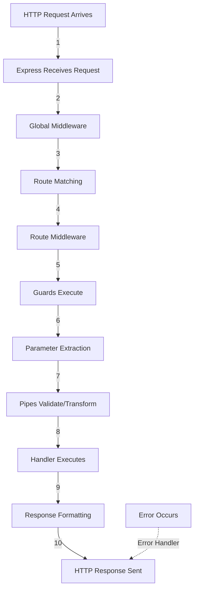
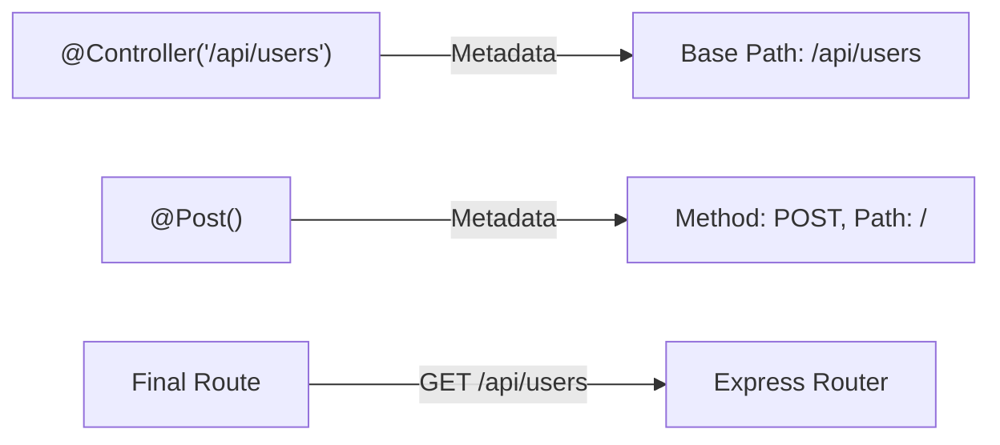
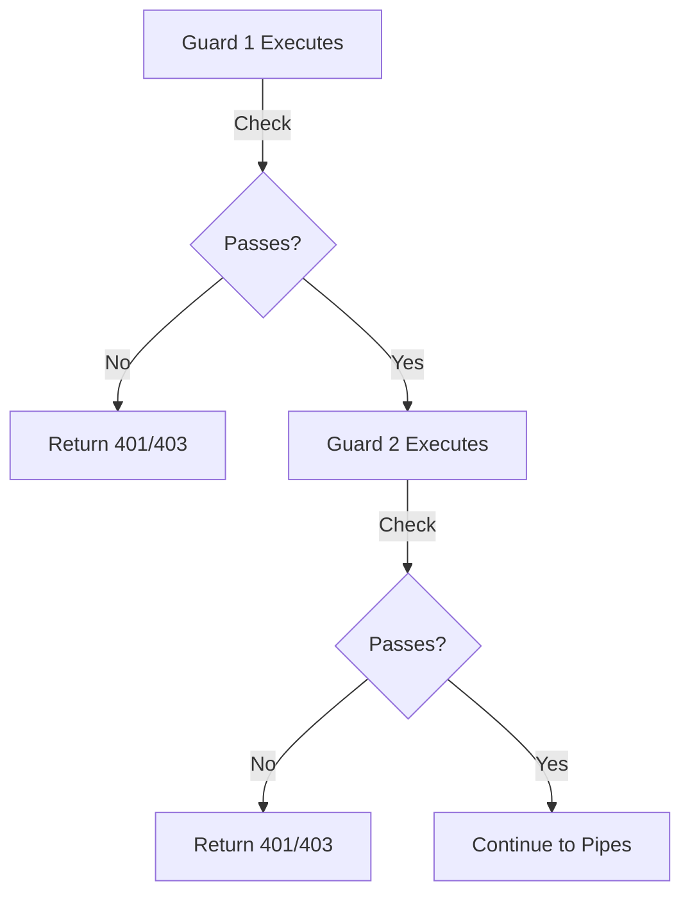
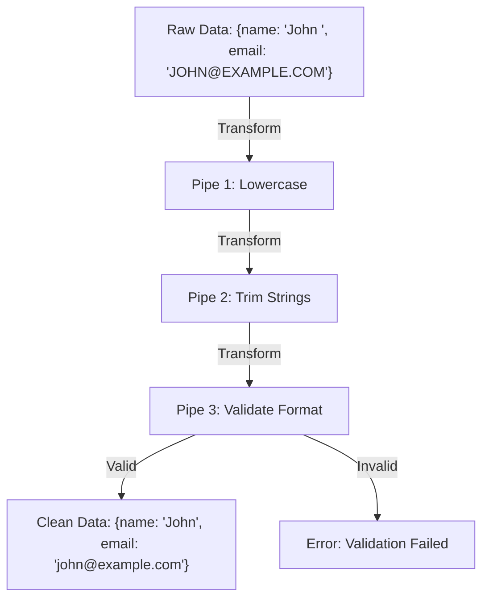
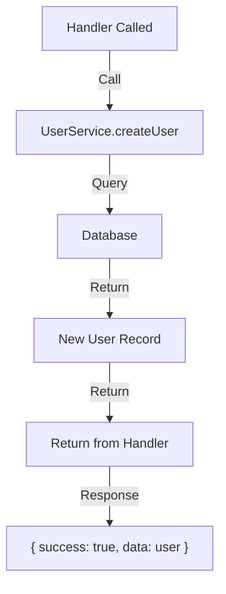
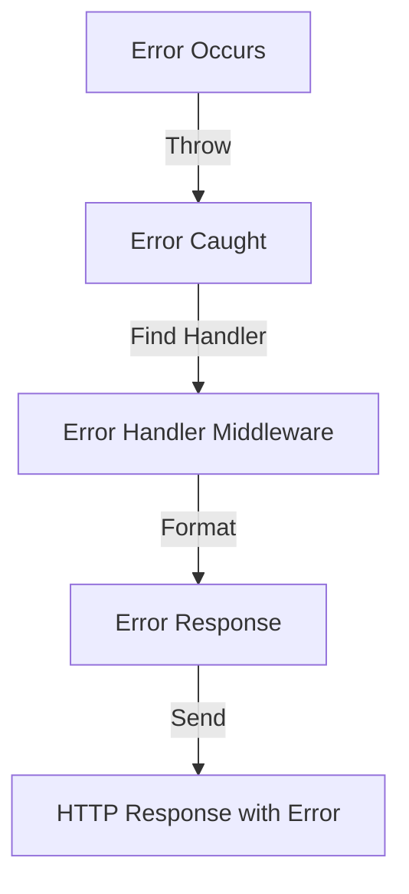
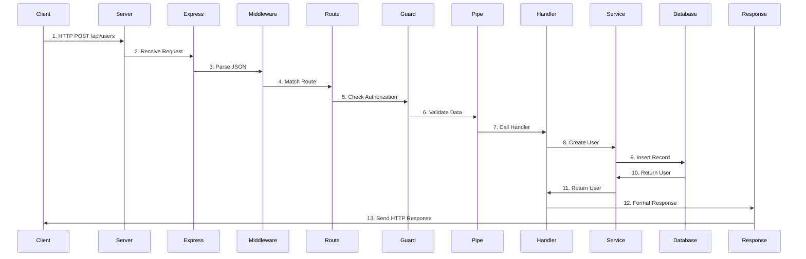

# Request Lifecycle

Understanding how a request flows through @framework/core is essential for building efficient APIs. This guide traces the complete journey of an HTTP request through the framework.

## Complete Request Flow

Here's the high-level flow of a request through the system:



## Detailed Lifecycle Stages

### Stage 1: Request Arrives

```typescript
// Client sends HTTP request
POST /api/users HTTP/1.1
Content-Type: application/json

{
  "name": "John",
  "email": "john@example.com"
}
```

**What Happens:**

- Request reaches Express.js server
- Express parses HTTP headers
- Raw body is buffered

**Time: ~1ms**

### Stage 2: Global Middleware

Global middleware runs for every request:

```typescript
const app = new Application({ corsEnabled: true });

// Built-in middleware that runs
// - express.json() - Parse JSON body
// - express.urlencoded() - Parse form data
// - cors() - Handle cross-origin requests
```

**Custom middleware:**

```typescript
app.useMiddleware((req, res, next) => {
  req.requestId = generateId();
  console.log(`[${req.requestId}] ${req.method} ${req.path}`);
  next();
});
```

**Request object at this point:**

```typescript
{
  method: 'POST',
  path: '/api/users',
  headers: { ... },
  body: { name: 'John', email: 'john@example.com' },
  requestId: 'req-123abc'
}
```

**Time: ~2-5ms**

### Stage 3: Route Matching

Express matches the request to a registered route:

```typescript
// Controller definition
@Controller('/api/users')
export class UserController {
  @Post()  // Matches POST /api/users
  async createUser(@Body() body: CreateUserDto, req: Request, res: Response) {
    // Handler
  }
}
```

**Route registration (happens at startup):**



The framework:

1. Reads controller metadata
2. Reads method decorators
3. Combines paths: `/api/users` + `` = `/api/users`
4. Registers with Express: `app.post('/api/users', handler)`

**Time: ~1ms (lookup)**

### Stage 4: Route-Level Middleware

Middleware specific to this route:

```typescript
@Controller('/api/users')
export class UserController {
  @Post()
  @UseMiddleware(AuthMiddleware, LoggingMiddleware)
  async createUser(@Body() body: CreateUserDto) {
    // Handler
  }
}
```

**Execution:**

```typescript
// AuthMiddleware runs
async (req, res, next) => {
  const token = req.headers.authorization?.split(' ')[1];
  if (!token) {
    return res.status(401).json({ error: 'Unauthorized' });
  }
  // Store user info in request
  req.user = await verifyToken(token);
  next();
}

// Then LoggingMiddleware runs
async (req, res, next) => {
  console.log(`User ${req.user.id} creating todo`);
  next();
}
```

**Time: ~10-50ms (depends on auth system)**

### Stage 5: Guards Execute

Guards protect routes by checking conditions:

```typescript
@Controller('/api/users')
export class UserController {
  @Post()
  @UseGuard(AuthGuard, RoleGuard)
  async createUser(@Body() body: CreateUserDto) {
    // Only authenticated users with admin role reach here
  }
}
```

**Guard implementation:**

```typescript
export async function AuthGuard(req: any, res: any, next: any): Promise<boolean> {
  if (!req.user) {
    res.status(401).json({ error: 'Not authenticated' });
    return false;
  }
  return true;  // Allow to proceed
}

export async function RoleGuard(req: any, res: any, next: any): Promise<boolean> {
  if (req.user.role !== 'admin') {
    res.status(403).json({ error: 'Insufficient permissions' });
    return false;
  }
  return true;  // Allow to proceed
}
```

**Guard Flow:**



**Time: ~5-20ms (depends on checks)**

### Stage 6: Parameter Extraction

The framework extracts parameters from the request:

```typescript
@Controller('/api/users')
export class UserController {
  @Post()
  async createUser(
    @Body() body: CreateUserDto,              // From JSON body
    @Param('id') id: string,                  // From URL path
    @Query('notify') notify: boolean,         // From query string
    @Req() req: Request,                      // Express request
    @Res() res: Response                      // Express response
  ) {
    // All parameters are now available
  }
}
```

**Extraction process:**

```typescript
// Framework reads parameter decorators
const params = Reflect.getMetadata('params', handler);

// Extracts from request
const extracted = {
  body: req.body,              // { name: 'John', email: '...' }
  id: req.params.id,           // 'user-123'
  notify: req.query.notify === 'true',  // boolean
  req,
  res
};

// Passes to handler in correct order
handler(extracted.body, extracted.id, extracted.notify, extracted.req, extracted.res);
```

**Time: ~1-2ms**

### Stage 7: Validation and Transformation (Pipes)

Pipes validate and transform data:

```typescript
@Controller('/api/users')
export class UserController {
  @Post()
  @UsePipe(ValidationPipe)
  async createUser(@Body() body: CreateUserDto) {
    // body is guaranteed to be valid at this point
  }
}
```

**Validation pipe implementation:**

```typescript
export class ValidationPipe implements PipeTransform {
  transform(value: any, metadata: any): any {
    // Example: Validate email format
    if (!value.email || !value.email.includes('@')) {
      throw new Error('Invalid email format');
    }

    // Example: Transform to lowercase
    value.email = value.email.toLowerCase();

    // Example: Trim strings
    if (value.name) {
      value.name = value.name.trim();
    }

    return value;  // Return transformed value
  }
}
```

**Pipe Flow:**



**Time: ~2-10ms (depends on validation complexity)**

### Stage 8: Handler Execution

The actual route handler executes:

```typescript
@Post()
async createUser(@Body() body: CreateUserDto): Promise<any> {
  // 1. Receive validated parameters
  console.log('Creating user:', body);

  // 2. Call service (may involve database queries)
  const user = await this.userService.createUser(body);

  // 3. Return response
  return { success: true, data: user };
}
```

**Inside the handler:**



**Time: ~50-500ms (database dependent)**

### Stage 9: Response Formatting

The response is formatted and sent:

```typescript
// Handler returns data
const response = {
  success: true,
  data: {
    id: 'user-123',
    name: 'John',
    email: 'john@example.com'
  }
};

// Express converts to JSON
const json = JSON.stringify(response);

// Sets appropriate headers
res.status(201);
res.set('Content-Type', 'application/json');
res.set('Content-Length', json.length);

// Sends body
res.send(json);
```

**HTTP Response sent to client:**

```
HTTP/1.1 201 Created
Content-Type: application/json
Content-Length: 75

{
  "success": true,
  "data": {
    "id": "user-123",
    "name": "John",
    "email": "john@example.com"
  }
}
```

**Time: ~1-2ms**

### Stage 10: Complete

Request-response cycle is complete. Client receives response.

**Total Time: ~80-600ms (typical)**

## Error Handling Lifecycle

When an error occurs, the lifecycle changes:



**Error handling example:**

```typescript
@Controller('/api/users')
export class UserController {
  @Post()
  async createUser(@Body() body: CreateUserDto) {
    try {
      // Validation in body might throw
      if (!body.email) {
        throw new BadRequestException('Email is required');
      }

      // Service call might throw
      const user = await this.userService.createUser(body);
      return user;
    } catch (error) {
      // Error is caught and formatted
      return {
        success: false,
        error: error.message
      };
    }
  }
}
```

**Error handling flow:**

```typescript
// Global error handler
app.useErrorHandler((error, req, res, next) => {
  console.error('Error:', error);

  const status = error.statusCode || 500;
  const message = error.message || 'Internal Server Error';

  res.status(status).json({
    success: false,
    error: message,
    statusCode: status,
    timestamp: new Date().toISOString(),
    path: req.path
  });
});
```

**Error Response:**

```json
{
  "success": false,
  "error": "Email is required",
  "statusCode": 400,
  "timestamp": "2024-05-28T10:30:45.123Z",
  "path": "/api/users"
}
```

## Complete Request Sequence Diagram

Here's the complete sequence of a successful request:



## Performance Optimization Tips

### 1. Minimize Middleware

Only use necessary middleware:

```typescript
// ❌ Too much middleware
app.useMiddleware(m1);
app.useMiddleware(m2);
app.useMiddleware(m3);
app.useMiddleware(m4);
app.useMiddleware(m5);

// ✅ Route-specific middleware
@Post()
@UseMiddleware(AuthMiddleware)
async handler() { }
```

### 2. Cache Guard Results

Avoid repeating expensive checks:

```typescript
export async function CachedAuthGuard(req: any, res: any, next: any): Promise<boolean> {
  if (req.cachedUser) {
    return true;  // Already checked
  }

  const user = await verifyToken(req.headers.authorization);
  req.cachedUser = user;  // Cache result
  return true;
}
```

### 3. Use Efficient Pipes

Keep validation simple and fast:

```typescript
// ✅ Fast validation
export class QuickValidationPipe implements PipeTransform {
  transform(value: any): any {
    // Simple checks only
    if (!value.name || !value.email) {
      throw new Error('Required fields missing');
    }
    return value;
  }
}
```

### 4. Optimize Handler Logic

Keep handler execution quick:

```typescript
// ❌ Slow - multiple database queries
@Post()
async createUser(@Body() body: CreateUserDto) {
  const emailExists = await this.userService.checkEmail(body.email);
  if (emailExists) throw new Error('Email exists');
  
  const user = await this.userService.createUser(body);
  const profile = await this.profileService.createProfile(user.id);
  return { user, profile };
}

// ✅ Fast - optimized logic
@Post()
async createUser(@Body() body: CreateUserDto) {
  // Database handles constraints
  const user = await this.userService.createUser(body);
  // Create related records together
  await this.profileService.createProfile(user.id);
  return user;
}
```

### 5. Use Async Operations

Don't block the event loop:

```typescript
// ❌ Blocks event loop
@Get('/large-file')
handler() {
  return fs.readFileSync('large-file.bin');  // Blocks
}

// ✅ Async operation
@Get('/large-file')
async handler() {
  return await fs.promises.readFile('large-file.bin');  // Non-blocking
}
```

## Timing Breakdown

Typical timing for different stages:

| Stage | Time |
|---|---|
| Network transmission | 10-100ms |
| Global middleware | 2-5ms |
| Route matching | 1ms |
| Route middleware | 10-50ms |
| Guards | 5-20ms |
| Parameter extraction | 1-2ms |
| Pipes (validation) | 2-10ms |
| Handler execution | 50-500ms |
| Response formatting | 1-2ms |
| **Total** | **~80-600ms** |

The largest time consumption is typically in handler execution (database queries, external API calls).

## Request Context

Throughout the request lifecycle, context is maintained:

```typescript
interface RequestContext {
  requestId: string;           // Unique ID for tracing
  userId?: string;             // From auth guard
  user?: User;                 // Authenticated user
  startTime: number;           // For performance tracking
  path: string;                // Request path
  method: string;              // HTTP method
  metadata?: Record<string, any>;  // Custom data
}
```

**Use context for logging:**

```typescript
app.useMiddleware((req: any, res, next) => {
  req.context = {
    requestId: generateId(),
    startTime: Date.now(),
    path: req.path,
    method: req.method
  };

  res.on('finish', () => {
    const duration = Date.now() - req.context.startTime;
    console.log(`[${req.context.requestId}] ${req.method} ${req.path} - ${res.statusCode} (${duration}ms)`);
  });

  next();
});
```

## Next Steps

Now that you understand the complete request lifecycle:

1. **[Building Apps](../building-apps/controllers-routing.mdx)** - Create complex applications
2. **[Core Concepts](../core-concepts/modules.mdx)** - Advanced features
3. **[Production](../production/deployment-overview.mdx)** - Deploy your app

## Summary

The request lifecycle in @framework/core:

✅ **Structured** - Clear stages ensure predictable behavior
✅ **Extensible** - Guards, pipes, and middleware allow customization
✅ **Efficient** - Optimized for performance
✅ **Type-Safe** - Full TypeScript support throughout
✅ **Observable** - Easy to log and monitor each stage

Understanding this flow helps you:

- Write better handlers
- Debug issues effectively
- Optimize performance
- Build robust APIs
- Handle errors gracefully
